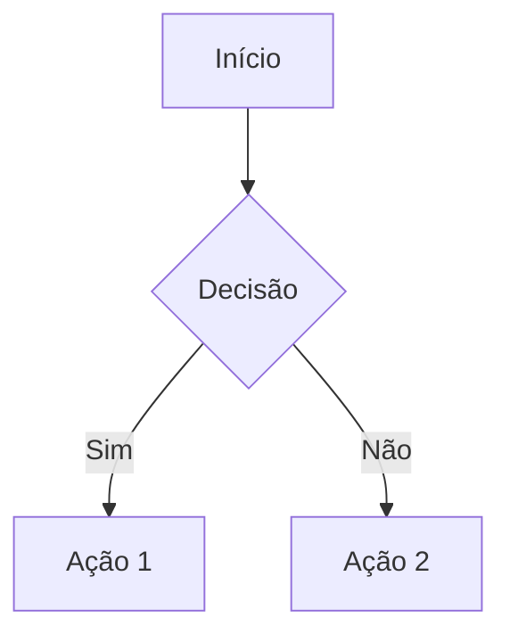
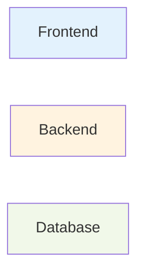

# 📝 Guia de Estilo da Documentação

Convenções e padrões para manter a documentação consistente e profissional.

## 🎯 Princípios

1. **Clareza sobre Complexidade** - Explique de forma simples, mesmo conceitos complexos
2. **Exemplos Práticos** - Sempre que possível, inclua exemplos de código
3. **Navegação Fácil** - Use links internos e índices detalhados
4. **Visual e Textual** - Combine diagramas com texto explicativo
5. **Atualização Contínua** - Mantenha sincronizado com o código

---

## 📐 Estrutura de Documentos

### Template Básico

```markdown
# 🎯 Título do Documento

Breve descrição do que este documento cobre.

> 💡 **Dica**: Informação importante ou sugestão de leitura complementar

## 📋 Índice

- [Seção 1](#seção-1)
- [Seção 2](#seção-2)

---

## Seção 1

Conteúdo...

---

**Última atualização**: DD/MM/AAAA  
**Versão**: X.Y.Z
```

### Hierarquia de Títulos

- `#` - Título principal do documento
- `##` - Seções principais
- `###` - Subseções
- `####` - Detalhes específicos (evitar mais que isso)

---

## 🎨 Uso de Emojis

### Documentação Geral
- 📚 Documentação/Índice
- 📖 Leitura/Conteúdo
- 📝 Notas/Changelog
- 🚀 Quick Start/Navegação
- 📋 Lista/Índice

### Funcionalidades
- ✨ Features/Novo
- 📦 Produtos/Pacotes
- 📊 Dados/Estatísticas
- 🏢 Empresa/Organização
- 🔧 Configuração/Tools
- 🔐 Segurança/Autenticação

### Status e Ações
- ✅ Completo/Sucesso
- ❌ Erro/Falha
- ⚠️ Aviso/Atenção
- 💡 Dica/Ideia
- 🔄 Processo/Fluxo
- 📈 Crescimento/Melhoria

### Tecnologias
- 🎨 Frontend/UI
- ⚙️ Backend/API
- 💾 Database
- 🧪 Testes
- 🐳 Docker
- 📱 Mobile/Responsivo

### Níveis de Prioridade
- 🔴 Crítico
- 🟡 Importante
- 🟢 Normal
- 🔵 Informação

---

## 💬 Tom e Linguagem

### ✅ Fazer

- Use voz ativa: "Execute o comando" vs "O comando deve ser executado"
- Seja direto: "Crie um produto" vs "Você pode criar um produto"
- Use "nós" para ações coletivas: "Vamos configurar..."
- Use "você" para instruções diretas: "Configure seu ambiente..."

### ❌ Evitar

- Jargões desnecessários
- Frases muito longas (max 2-3 linhas)
- Ambiguidades: "pode", "talvez", "geralmente"
- Abreviações sem explicação prévia

---

## 📊 Formatação de Código

### Blocos de Código

Sempre especifique a linguagem:

````markdown
```php
// Código PHP
public function example() {
    return true;
}
```

```typescript
// Código TypeScript
const example = (): boolean => {
    return true;
}
```

```bash
# Comandos shell
php artisan migrate
```
````

### Código Inline

Use backticks para:
- Nomes de arquivos: `Product.php`
- Comandos: `npm install`
- Variáveis: `stock_quantity`
- Valores: `true`, `null`, `42`

---

## 🔗 Links e Referências

### Links Internos

```markdown
[Texto do Link](./arquivo.md)
[Seção Específica](./arquivo.md#seção)
```

### Links Externos

```markdown
[Laravel Documentation](https://laravel.com/docs)
```

### Referências Cruzadas

Sempre que mencionar um conceito documentado em outro lugar, crie um link:

```markdown
Para mais detalhes, veja [Movimentações de Estoque](./inventory-system.md#movimentações-de-estoque).
```

---

## 📋 Tabelas

### Formato Padrão

```markdown
| Coluna 1 | Coluna 2 | Coluna 3 |
|----------|----------|----------|
| Valor 1  | Valor 2  | Valor 3  |
| Valor 4  | Valor 5  | Valor 6  |
```

### Dicas para Tabelas

- Alinhe as colunas para melhor legibilidade no código
- Use `---` para separar header do corpo
- Mantenha conteúdo conciso
- Para dados muito extensos, considere listas ou seções separadas

---

## 📊 Diagramas

### Mermaid

Use Mermaid para diagramas:

````markdown

````

### Tipos Recomendados

- **Entity Relationship**: Modelo de dados
- **Sequence**: Fluxos de comunicação
- **Flowchart**: Processos e decisões
- **Class**: Estrutura de classes
- **Graph**: Arquitetura e dependências

### Convenções de Cores



- Frontend: Azul claro (#e3f2fd)
- Backend: Laranja claro (#fff3e0)
- Database: Verde claro (#f1f8e9)
- Erro/Crítico: Vermelho claro (#ffcdd2)
- Atenção: Amarelo claro (#fff9c4)

---

## ✅ Listas de Verificação

### Para Tarefas

```markdown
- [ ] Tarefa não concluída
- [x] Tarefa concluída
```

### Para Features

```markdown
- ✅ Feature implementada
- 🚧 Em desenvolvimento
- 📋 Planejado
```

---

## 📝 Exemplos Práticos

### Sempre Inclua

1. **Exemplo de uso básico**
   ```php
   // Como usar de forma simples
   ```

2. **Exemplo com todas as opções**
   ```php
   // Uso avançado com todos os parâmetros
   ```

3. **Exemplo de erro comum**
   ```php
   // O que NÃO fazer
   ```

---

## 🔍 Seções Especiais

### Avisos e Dicas

```markdown
> ⚠️ **Atenção**: Informação crítica que pode causar problemas

> 💡 **Dica**: Sugestão útil ou best practice

> 📝 **Nota**: Informação adicional relevante

> ❌ **Não faça**: Antipadrão ou erro comum
```

### Troubleshooting

Sempre estruture problemas assim:

```markdown
### Problema X acontecendo?

**Sintomas**:
- Erro Y aparece
- Comportamento Z

**Causa**:
Explicação da causa raiz

**Solução**:
1. Passo 1
2. Passo 2
3. Passo 3

**Verificação**:
Como confirmar que está resolvido
```

---

## 📏 Convenções de Nomenclatura

### Arquivos

- Use kebab-case: `inventory-system.md`
- Seja descritivo: `api-authentication.md`
- Use ALL CAPS para especiais: `README.md`, `CHANGELOG.md`

### Âncoras (Links Internos)

GitHub/GitLab convertem automaticamente títulos em âncoras:
- Espaços viram `-`
- Caracteres especiais são removidos
- Tudo em minúsculo

```markdown
## Minha Seção Especial
[Link para seção](#minha-seção-especial)
```

---

## 📊 Métricas de Qualidade

### Checklist de Revisão

Antes de publicar, verifique:

- [ ] Ortografia e gramática revisadas
- [ ] Links internos funcionando
- [ ] Links externos válidos
- [ ] Código testado e funcional
- [ ] Diagramas renderizando corretamente
- [ ] Índice atualizado
- [ ] Data de atualização no rodapé
- [ ] Emojis consistentes com o guia
- [ ] Exemplos práticos incluídos
- [ ] Referências cruzadas criadas

---

## 🎓 Recursos de Referência

### Markdown

- [GitHub Flavored Markdown](https://github.github.com/gfm/)
- [Markdown Guide](https://www.markdownguide.org/)

### Mermaid

- [Mermaid Documentation](https://mermaid.js.org/)
- [Mermaid Live Editor](https://mermaid.live/)

### Escrita Técnica

- [Google Developer Documentation Style Guide](https://developers.google.com/style)
- [Microsoft Writing Style Guide](https://learn.microsoft.com/en-us/style-guide/welcome/)

---

## 🔄 Processo de Atualização

1. **Identifique mudanças** no código que afetam a documentação
2. **Atualize** a documentação relevante
3. **Revise** links e referências
4. **Teste** exemplos de código
5. **Atualize** data no rodapé
6. **Registre** no CHANGELOG.md

---

## 📞 Manutenção

### Responsabilidades

- **Desenvolvedor**: Atualiza docs ao mudar código
- **Tech Lead**: Revisa qualidade e consistência
- **Documentador**: Expande e melhora conteúdo existente

### Frequência

- **A cada PR**: Verificar se docs precisam atualização
- **Mensalmente**: Revisar links externos
- **Trimestralmente**: Audit completo de qualidade

---

**Última atualização**: 01/01/2026  
**Versão**: 1.0.0
