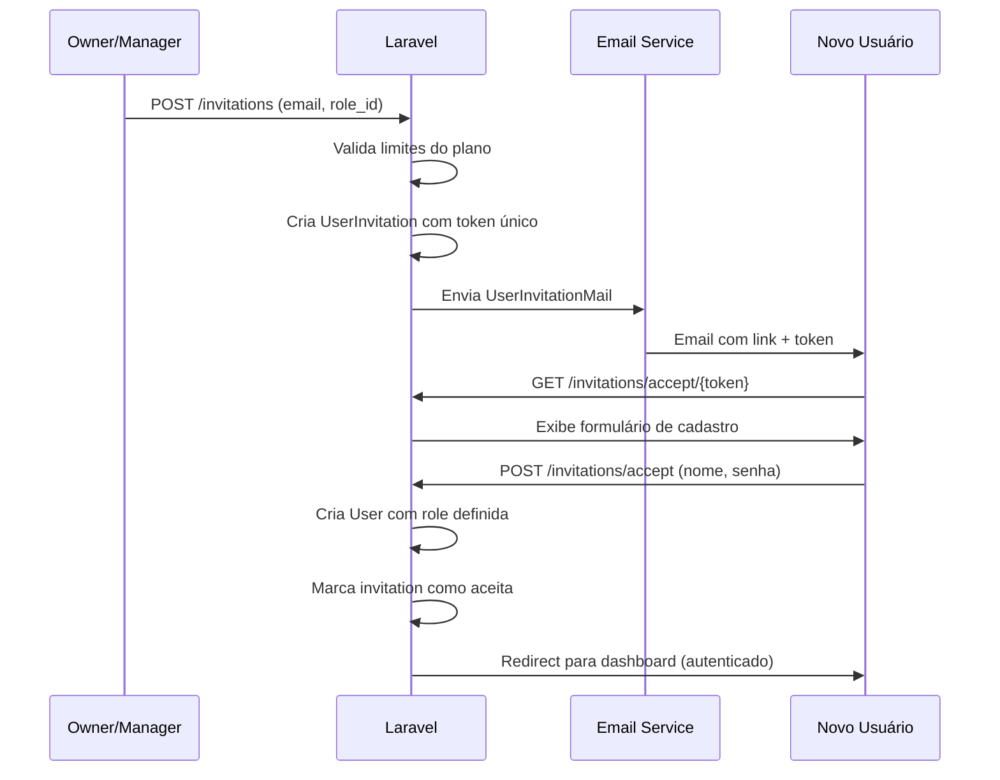
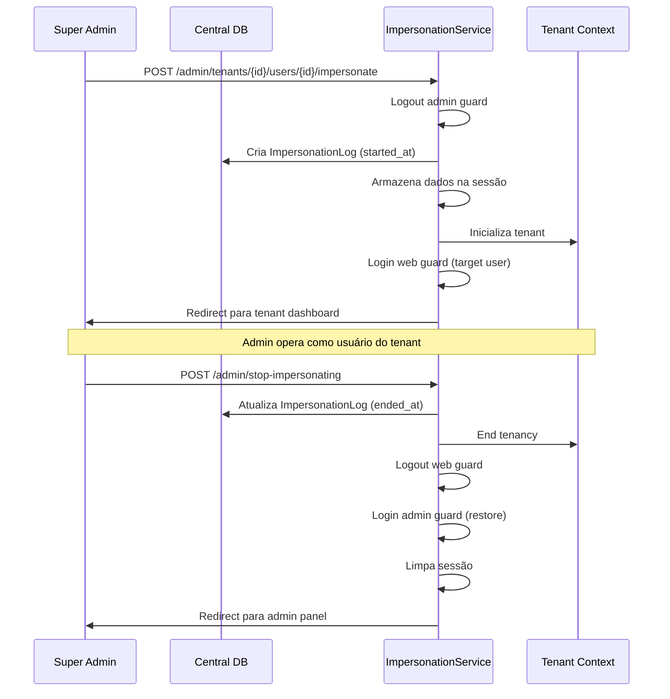
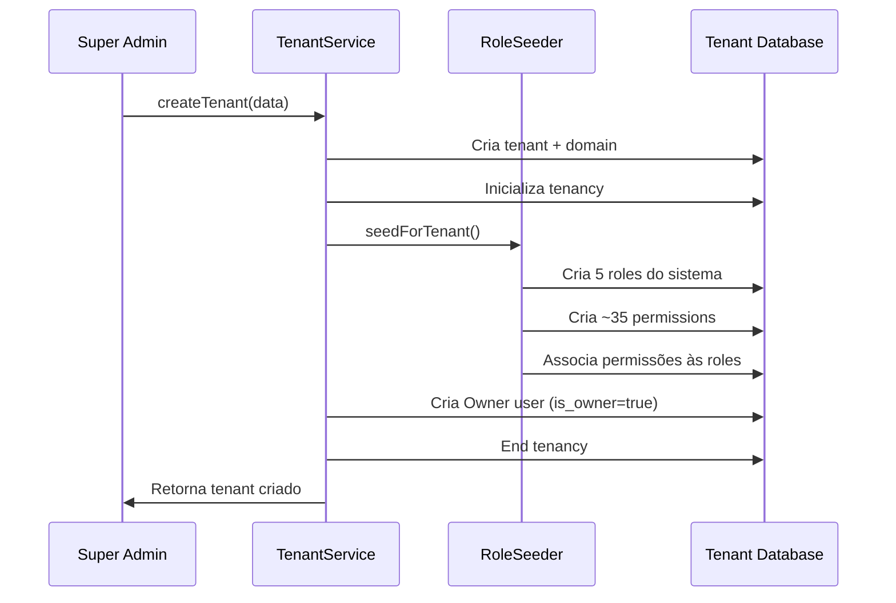

# Sistema de Gerenciamento de Usuários - Multi-Tenancy

## 📋 Índice

1. [Visão Geral](#visão-geral)
2. [Arquitetura do Sistema](#arquitetura-do-sistema)
3. [Fluxos Principais](#fluxos-principais)
4. [Componentes do Sistema](#componentes-do-sistema)
5. [Segurança](#segurança)
6. [Guias de Uso](#guias-de-uso)
7. [API Reference](#api-reference)

---

## Visão Geral

Sistema completo de gerenciamento de usuários para aplicação multi-tenant Laravel 11, incluindo:

- ✅ **Sistema de Roles e Permissões**: Controle granular de acesso com 5 roles predefinidas + roles customizáveis
- ✅ **Convites por Email**: Usuários são convidados e definem suas próprias senhas
- ✅ **Impersonation**: Super admins podem operar como qualquer usuário para suporte
- ✅ **Audit Logs**: Registro completo de todas as sessões de impersonation
- ✅ **Validação de Plano**: Limites de usuários baseados no plano do tenant
- ✅ **Auto-criação de Owner**: Primeiro usuário é automaticamente Owner ao criar tenant

### Características Principais

- **Multi-tenant isolado**: Cada tenant tem seus próprios usuários e roles
- **Roles do sistema protegidas**: 5 roles predefinidas que não podem ser excluídas
- **Permissões granulares**: ~35 permissões organizadas por módulo
- **Segurança robusta**: Tokens únicos, expiração de convites, proteção de Owner
- **Auditoria completa**: Logs centralizados de impersonation com IP e user agent

---

## Arquitetura do Sistema

### 1. Database Schema

#### Tenant Database

```sql
-- Roles Table
roles (
  id CHAR(26) PRIMARY KEY,
  name VARCHAR(255),
  slug VARCHAR(255) UNIQUE,
  description TEXT,
  is_system BOOLEAN,  -- Protege roles predefinidas
  created_at, updated_at
)

-- Permissions Table
permissions (
  id CHAR(26) PRIMARY KEY,
  name VARCHAR(255),
  slug VARCHAR(255) UNIQUE,
  description TEXT,
  module VARCHAR(255),  -- clients, vehicles, services, etc.
  created_at, updated_at
)

-- Permission-Role Pivot
permission_role (
  permission_id CHAR(26),
  role_id CHAR(26),
  PRIMARY KEY (permission_id, role_id)
)

-- Users (enhanced)
users (
  ...existing fields,
  role_id CHAR(26),
  is_owner BOOLEAN DEFAULT FALSE,
  FOREIGN KEY (role_id) REFERENCES roles(id)
)

-- User Invitations
user_invitations (
  id CHAR(26) PRIMARY KEY,
  email VARCHAR(255),
  role_id CHAR(26),
  token VARCHAR(64) UNIQUE,
  invited_by_user_id CHAR(26),
  expires_at TIMESTAMP,
  accepted_at TIMESTAMP NULL,
  created_at, updated_at,
  FOREIGN KEY (role_id) REFERENCES roles(id),
  FOREIGN KEY (invited_by_user_id) REFERENCES users(id)
)
```

#### Central Database

```sql
-- Impersonation Logs (central)
impersonation_logs (
  id CHAR(26) PRIMARY KEY,
  admin_id CHAR(26),
  admin_name VARCHAR(255),
  admin_email VARCHAR(255),
  tenant_id VARCHAR(255),
  tenant_name VARCHAR(255),
  user_id CHAR(26),
  user_name VARCHAR(255),
  user_email VARCHAR(255),
  started_at TIMESTAMP,
  ended_at TIMESTAMP NULL,
  ip_address VARCHAR(45),
  user_agent TEXT,
  created_at, updated_at,
  FOREIGN KEY (admin_id) REFERENCES admin_users(id)
)
```

### 2. Roles Predefinidas

| Role | Slug | Descrição | Permissões |
|------|------|-----------|------------|
| **Owner** | `owner` | Proprietário do tenant | Todas as permissões (~35) |
| **Manager** | `manager` | Gerente operacional | Operações + visualizações (exceto configurações críticas) |
| **Attendant** | `attendant` | Atendente | Clientes, veículos, serviços (view/create) |
| **Mechanic** | `mechanic` | Mecânico | Serviços, produtos, estoque |
| **Viewer** | `viewer` | Visualizador | Apenas leitura (view em todos os módulos) |

### 3. Módulos de Permissões

Cada módulo possui 4 permissões básicas (CRUD):

- **clients**: `view`, `create`, `update`, `delete`
- **vehicles**: `view`, `create`, `update`, `delete`
- **services**: `view`, `create`, `update`, `delete`
- **products**: `view`, `create`, `update`, `delete`
- **suppliers**: `view`, `create`, `update`, `delete`
- **stock-movements**: `view`, `create`, `update`, `delete`
- **settings**: `view`, `update`
- **users**: `view`, `invite`, `update`, `change-role`, `delete`

---

## Fluxos Principais

### 1. Fluxo de Convite de Usuário



### 2. Fluxo de Impersonation



### 3. Fluxo de Criação de Tenant



---

## Componentes do Sistema

### Backend

#### Models

- **`User`**: Model principal com trait `HasRoleAndPermissions`
  - Métodos: `hasRole()`, `can()`, `cannot()`, `isOwner()`, `assignRole()`, `getPermissionSlugs()`
- **`Role`**: Roles do sistema e customizadas
- **`Permission`**: Permissões granulares por módulo
- **`UserInvitation`**: Convites pendentes com token e expiração
- **`ImpersonationLog`**: Audit trail no banco central

#### Services

- **`InvitationService`**: Gerencia ciclo de vida de convites
  - `invite()`, `resend()`, `cancel()`, `accept()`
- **`UserService`**: CRUD de usuários com validações
  - `create()`, `update()`, `changeRole()`, `delete()`, `validatePlanLimits()`
- **`RoleService`**: Gerenciamento de roles
  - `create()`, `update()`, `delete()`, `syncPermissions()`
- **`ImpersonationService`**: Controla sessões de impersonation
  - `impersonate()`, `stopImpersonation()`, `isImpersonating()`, `getImpersonationData()`

#### DTOs

- `InvitationInputDTO`, `AcceptInvitationDTO`
- `UserInputDTO`, `UserOutputDTO`, `UserWithRoleDTO`
- `RoleInputDTO`, `RoleOutputDTO`, `RoleWithPermissionsDTO`

#### Middleware

- **`ShareImpersonationState`**: Injeta dados de impersonation no Inertia

### Frontend (Vue 3 + TypeScript)

#### Pages

**Usuários:**
- `pages/users/Index.vue`: Lista de usuários com busca e ações
- `pages/users/Invite.vue`: Formulário de convite
- `pages/users/ChangeRole.vue`: Alteração de role com avisos

**Roles:**
- `pages/roles/Index.vue`: Lista de roles (sistema + customizadas)
- `pages/roles/Create.vue`: Criar role customizada
- `pages/roles/ManagePermissions.vue`: Checkbox tree de permissões por módulo

**Convites:**
- `pages/invitations/Index.vue`: Convites pendentes (reenviar, cancelar)
- `pages/invitations/Accept.vue`: Página pública de aceite (sem auth)

**Admin:**
- `pages/admin/impersonation-logs/Index.vue`: Logs de auditoria

#### Components

- `ImpersonationBanner.vue`: Banner sticky amarelo no topo durante impersonation
- `admin/ImpersonateUserDialog.vue`: Modal de seleção de usuário para impersonate

---

## Segurança

### 1. Proteção do Owner

```php
// UserService - Impede exclusão do Owner
if ($user->is_owner) {
    throw new CannotDeleteOwnerException();
}

// UsersController - Impede alteração de role do Owner
if ($user->is_owner) {
    throw new CannotChangeOwnerRoleException();
}
```

### 2. Validação de Convites

- Token único de 64 caracteres gerado com `Str::random(64)`
- Expiração em 7 dias (configurável)
- Validação de email único (existente ou com convite pendente)
- Verificação de limites do plano antes de aceitar

### 3. Impersonation Security

- Apenas super admins (guard `admin`) podem impersonate
- Audit log completo no banco central (sobrevive à exclusão do tenant)
- IP e User Agent registrados
- Session-based (dados não expostos no frontend)
- Middleware compartilha apenas dados necessários via Inertia

### 4. Roles do Sistema

- Flag `is_system=true` impede exclusão
- Nome pode ser customizado (descrição e permissões sim)
- RoleSeeder garante recriação consistente

---

## Guias de Uso

### Como Convidar um Usuário

1. Acesse **Usuários** → **Convidar Usuário**
2. Preencha email e selecione a role desejada
3. Clique em **Enviar Convite**
4. O usuário receberá um email com link válido por 7 dias
5. Acompanhe em **Ver convites pendentes**

### Como Aceitar um Convite

1. Clique no link recebido no email
2. Preencha seu nome completo
3. Defina uma senha segura (mín. 8 caracteres)
4. Clique em **Criar Conta e Acessar**
5. Você será redirecionado para o dashboard

### Como Gerenciar Roles

1. Acesse **Roles e Permissões**
2. Para criar nova role: **Nova Role** → preencha nome e descrição
3. Para editar permissões: **Gerenciar Permissões** na role desejada
4. Marque/desmarque permissões por módulo
5. **Salvar Permissões**

### Como Usar Impersonation (Admin)

1. No painel admin, acesse o tenant desejado
2. Clique em **Impersonate User**
3. Selecione o usuário na lista
4. Você será redirecionado para o tenant
5. Banner amarelo indica modo impersonation ativo
6. Para sair: **Sair do Impersonate** no banner

---

## API Reference

### Invitations

```http
POST /invitations
Body: { email, role_id }
Response: Redirect to /users

POST /invitations/{id}/resend
Response: Redirect back

DELETE /invitations/{id}
Response: Redirect back

GET /invitations/accept/{token}
Response: Inertia page

POST /invitations/accept
Body: { token, name, password, password_confirmation }
Response: Redirect to /dashboard
```

### Users

```http
GET /users
Response: Inertia page with users

PUT /users/{id}/change-role
Body: { role_id }
Response: Redirect back

DELETE /users/{id}
Response: Redirect back
```

### Roles

```http
GET /roles
Response: Inertia page with roles

POST /roles
Body: { name, description }
Response: Redirect back

PUT /roles/{id}
Body: { name, description }
Response: Redirect back

DELETE /roles/{id}
Response: Redirect back

PUT /roles/{id}/permissions
Body: { permission_ids: [] }
Response: Redirect back
```

### Permissions

```http
GET /permissions
Response: Inertia page with all permissions
```

### Impersonation (Admin Routes)

```http
POST /admin/tenants/{tenant}/users/{user}/impersonate
Response: Redirect to tenant dashboard

POST /admin/stop-impersonating
Response: Redirect to /admin/tenants

GET /admin/impersonation-logs
Response: Inertia page with logs
```

---

## Troubleshooting

### Convite expirado

- Reenvie o convite pela interface de convites pendentes
- Um novo token será gerado com nova data de expiração

### Usuário não recebe email

- Verifique configurações de email em `.env`
- Em desenvolvimento, emails estão em `storage/logs/laravel.log`
- Considere usar Mailtrap ou similar para testes

### Erro ao alterar role

- Verifique se não está tentando alterar o Owner
- Confirme que a role de destino existe

### Impersonation não funciona

- Verifique se está autenticado como admin (guard `admin`)
- Confirme que o middleware `ShareImpersonationState` está registrado
- Verifique se o tenant está ativo

---

## Próximos Passos

- [ ] Implementar verificação de permissões nos controllers (middleware)
- [ ] Adicionar 2FA para usuários sensíveis
- [ ] Criar relatórios de atividades por usuário
- [ ] Implementar histórico de alterações de roles
- [ ] Adicionar notificações quando role é alterada

---

**Documentação criada em:** Janeiro 2026  
**Versão:** 1.0.0  
**Autor:** Sistema App Oficina
