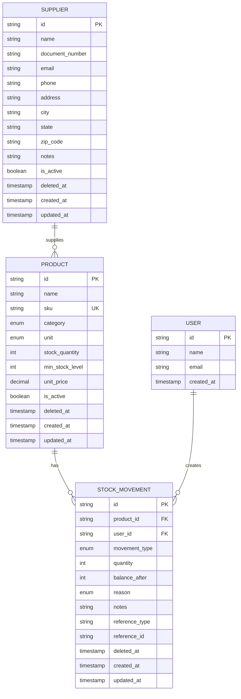
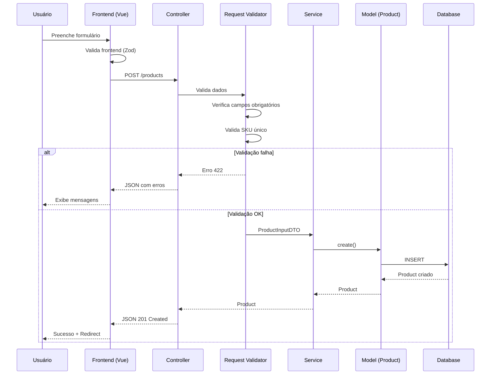
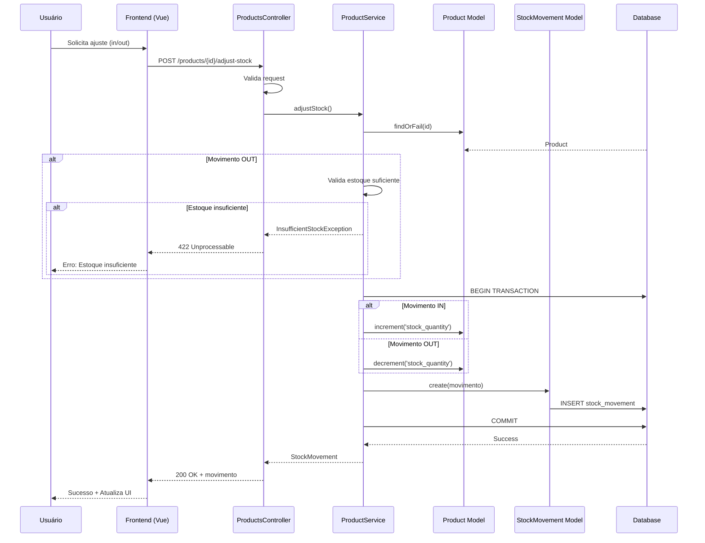
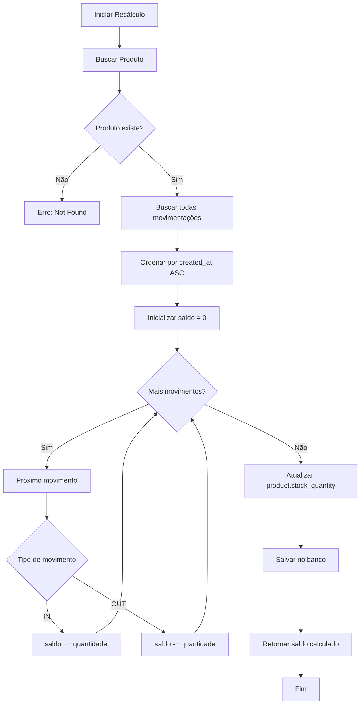
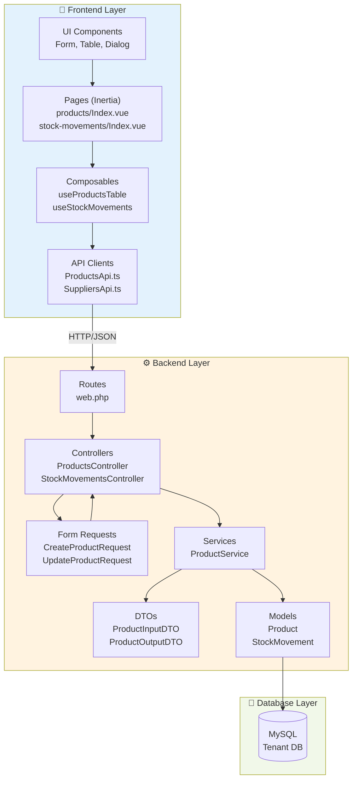
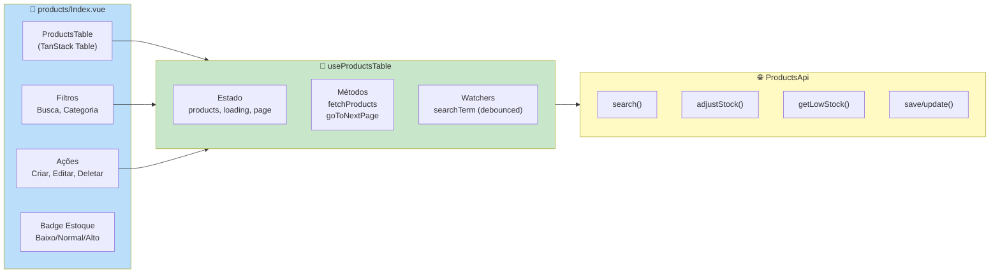
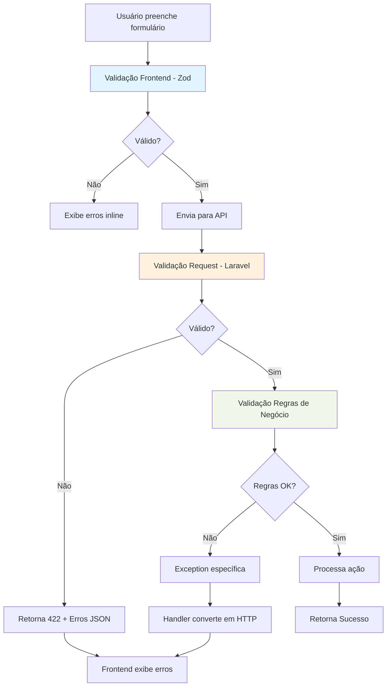
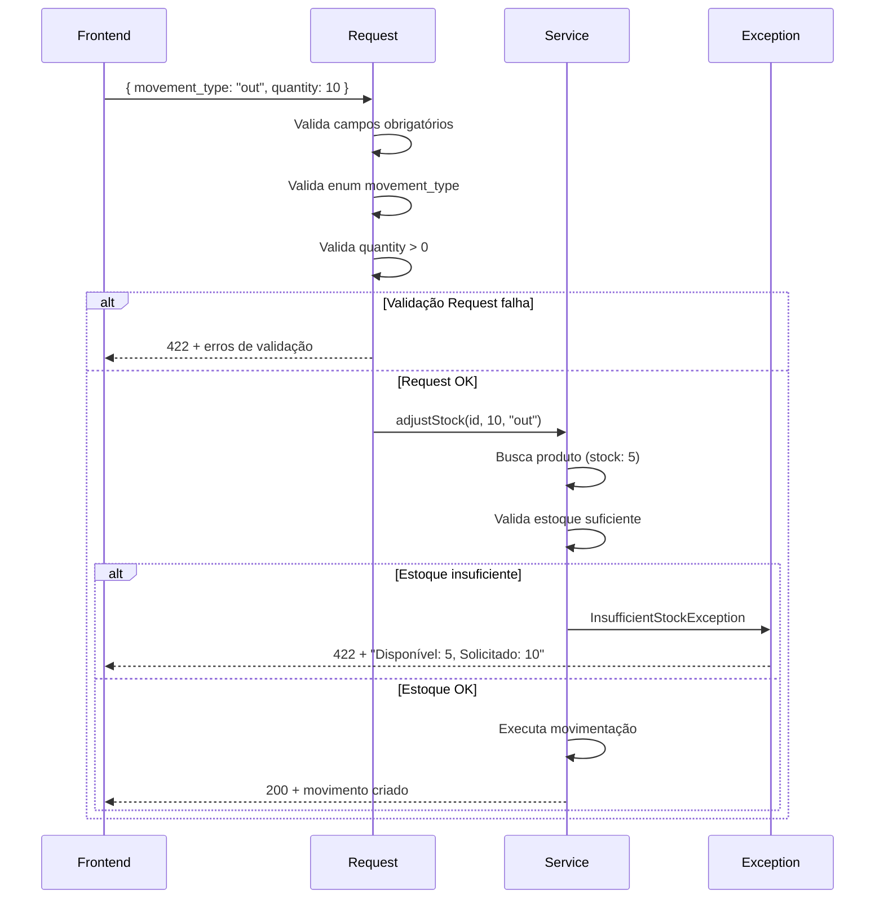
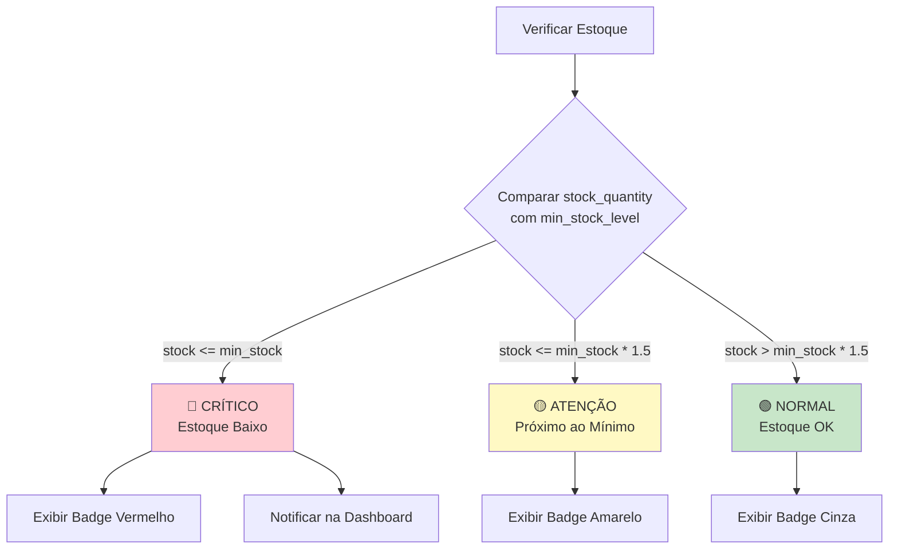
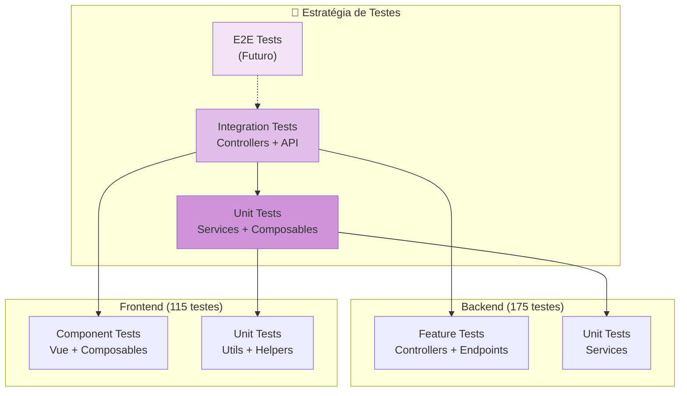

# 📊 Diagramas do Sistema de Estoque

Diagramas visuais para entender o fluxo e a arquitetura do sistema de gestão de estoque.

## 🗂️ Modelo de Dados

### Relacionamentos entre Entidades

## 🔄 Fluxos de Processo

### 1. Fluxo de Criação de Produto

### 2. Fluxo de Ajuste de Estoque

### 3. Fluxo de Recálculo de Estoque

## 🏗️ Arquitetura de Camadas

### Estrutura de Componentes

## 📱 Componentes Frontend

### Estrutura de Páginas de Produtos

## 🔐 Fluxo de Validação

### Validação em Múltiplas Camadas

### Exemplo de Validação de Ajuste de Estoque

## 📊 Estados de Estoque

### Classificação de Níveis

## 🧪 Cobertura de Testes

### Pirâmide de Testes

---

## 📚 Referências Visuais

### Convenções de Cores

- 🔴 **Vermelho**: Crítico, Erro, Estoque Baixo
- 🟡 **Amarelo**: Atenção, Warning, Próximo ao Limite
- 🟢 **Verde**: Sucesso, Normal, OK
- 🔵 **Azul**: Informação, Links, Navegação
- ⚪ **Cinza**: Neutro, Inativo, Padrão

### Ícones do Sistema

- 📦 Produtos
- 📊 Movimentações
- 🏢 Fornecedores
- ➕ Entrada (IN)
- ➖ Saída (OUT)
- 🔄 Recálculo
- ⚠️ Alerta
- ✅ Sucesso
- ❌ Erro

---

**Última atualização**: 01/01/2026  
**Versão**: 1.0.0
