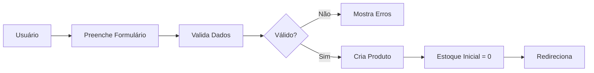
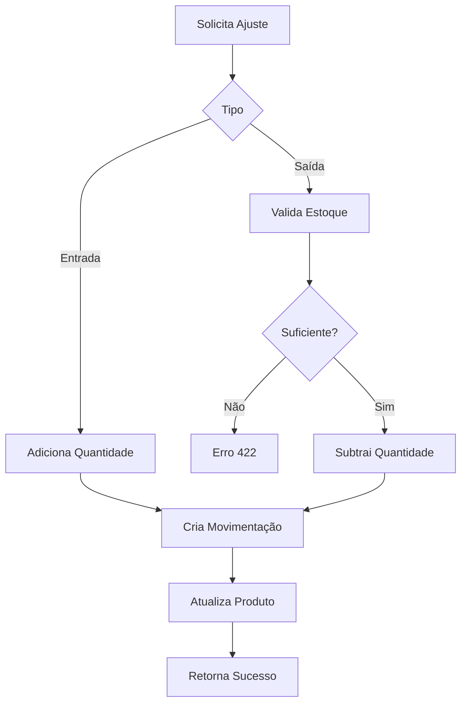

# 📦 Sistema de Gestão de Estoque

Documentação completa do sistema de gestão de produtos, estoque e fornecedores do App Oficina.

> 💡 **Dica**: Confira os [diagramas visuais](./diagrams.md) para entender melhor os fluxos e arquitetura do sistema.

## 📋 Índice

- [Visão Geral](#visão-geral)
- [Produtos](#produtos)
- [Movimentações de Estoque](#movimentações-de-estoque)
- [Fornecedores](#fornecedores)
- [API Endpoints](#api-endpoints)
- [Testes](#testes)

---

## 🎯 Visão Geral

O sistema de gestão de estoque foi desenvolvido para controlar produtos, movimentações e fornecedores em oficinas mecânicas. Ele oferece:

- ✅ Cadastro completo de produtos com categorias
- ✅ Controle de estoque em tempo real
- ✅ Histórico completo de movimentações
- ✅ Gestão de fornecedores
- ✅ Alertas de estoque baixo
- ✅ Rastreabilidade total de transações

---

## 📦 Produtos

### Estrutura de Dados

```php
Product {
    id: string (ULID)
    name: string
    sku: string (nullable, único)
    category: enum (engine, transmission, suspension, brakes, electrical, body, fluids, tires, accessories, tools, other)
    unit: enum (unit, liter, kilogram, meter, box, package, set, pair)
    stock_quantity: int
    min_stock_level: int
    unit_price: decimal(10,2)
    is_active: boolean
    deleted_at: timestamp (soft delete)
    created_at: timestamp
    updated_at: timestamp
}
```

### Categorias Disponíveis

| Categoria | Descrição |
|-----------|-----------|
| `engine` | Motor |
| `transmission` | Transmissão |
| `suspension` | Suspensão |
| `brakes` | Freios |
| `electrical` | Elétrica |
| `body` | Carroceria |
| `fluids` | Fluidos |
| `tires` | Pneus |
| `accessories` | Acessórios |
| `tools` | Ferramentas |
| `other` | Outros |

### Unidades de Medida

| Unidade | Abreviação |
|---------|------------|
| `unit` | un |
| `liter` | L |
| `kilogram` | kg |
| `meter` | m |
| `box` | cx |
| `package` | pct |
| `set` | conj |
| `pair` | par |

### Regras de Negócio

1. **SKU Único**: O SKU (Stock Keeping Unit) é opcional, mas quando fornecido deve ser único
2. **Estoque Mínimo**: Todo produto deve ter um nível mínimo de estoque configurado
3. **Validação de Preço**: O preço unitário deve ser maior que zero
4. **Soft Delete**: Produtos são marcados como deletados, não removidos fisicamente
5. **Estoque Negativo**: Não é permitido estoque negativo - validado antes de movimentações de saída

### Funcionalidades

#### 1. Criar Produto

```php
POST /products

{
    "name": "Óleo de Motor 5W30",
    "sku": "OIL-5W30-001",
    "category": "fluids",
    "unit": "liter",
    "stock_quantity": 50,
    "min_stock_level": 10,
    "unit_price": 45.90,
    "is_active": true
}
```

#### 2. Atualizar Produto

```php
PUT /products/{id}

{
    "name": "Óleo de Motor 5W30 Sintético",
    "unit_price": 52.90
}
```

#### 3. Listar Produtos

```php
GET /products/filters?search=óleo&page=1&per_page=15&sort_by=name&sort_direction=asc

// Resposta
{
    "products": {
        "items": [...],
        "total_items": 45
    }
}
```

#### 4. Produtos com Estoque Baixo

```php
GET /products/low-stock

// Retorna produtos onde stock_quantity <= min_stock_level
{
    "products": [...],
    "count": 8
}
```

---

## 📊 Movimentações de Estoque

### Estrutura de Dados

```php
StockMovement {
    id: string (ULID)
    product_id: string (FK)
    movement_type: enum (in, out)
    quantity: int
    balance_after: int
    reason: enum (purchase, sale, adjustment, return, loss, transfer, initial, other)
    notes: string (nullable, max 500)
    reference_type: string (nullable)
    reference_id: string (nullable)
    user_id: string (FK)
    deleted_at: timestamp (soft delete)
    created_at: timestamp
    updated_at: timestamp
}
```

### Tipos de Movimentação

| Tipo | Descrição | Efeito no Estoque |
|------|-----------|-------------------|
| `in` | Entrada | Aumenta (+) |
| `out` | Saída | Diminui (-) |

### Motivos de Movimentação

| Motivo | Uso Típico | Tipo |
|--------|-----------|------|
| `purchase` | Compra de fornecedor | in |
| `sale` | Venda para cliente | out |
| `adjustment` | Ajuste de inventário | in/out |
| `return` | Devolução | in/out |
| `loss` | Perda/Avaria | out |
| `transfer` | Transferência | in/out |
| `initial` | Estoque inicial | in |
| `other` | Outros motivos | in/out |

### Regras de Negócio

1. **Validação de Estoque**: Antes de uma saída, o sistema valida se há estoque suficiente
2. **Saldo Após**: Cada movimentação registra o saldo do produto após a operação
3. **Transacional**: Movimentações são executadas em transações DB para garantir consistência
4. **Auditoria**: Cada movimentação registra o usuário responsável
5. **Rastreabilidade**: É possível vincular movimentações a outras entidades (pedidos, serviços, etc.)

### Funcionalidades

#### 1. Ajustar Estoque

```php
POST /products/{id}/adjust-stock

{
    "movement_type": "in",
    "quantity": 10,
    "reason": "purchase",
    "notes": "Compra da ABC Distribuidora - NF 12345"
}
```

**Validações:**
- Se `movement_type = out`, valida estoque suficiente
- Retorna HTTP 422 com mensagem de erro se estoque insuficiente

```php
// Resposta de sucesso
{
    "message": "Estoque ajustado com sucesso",
    "movement_id": "01KDXN...",
    "balance_after": 60
}

// Resposta de erro (estoque insuficiente)
{
    "message": "Estoque insuficiente. Disponível: 5, Solicitado: 10",
    "errors": {
        "quantity": ["Estoque insuficiente. Disponível: 5, Solicitado: 10"]
    }
}
```

#### 2. Histórico de Movimentações

```php
GET /stock-movements/filters?product_id={id}&page=1&per_page=20

// Filtros disponíveis
- movement_type: in/out
- reason: purchase/sale/etc
- product_id: ID do produto
- date_from: data inicial
- date_to: data final
```

#### 3. Recalcular Estoque

O sistema oferece uma funcionalidade para recalcular o estoque com base no histórico de movimentações:

```php
// Service method
ProductService::recalculateStock(string $productId): int
```

Esta função:
1. Busca todas as movimentações do produto ordenadas por data
2. Recalcula o saldo considerando entradas (+) e saídas (-)
3. Atualiza o `stock_quantity` do produto
4. Retorna o saldo calculado

**Quando usar:**
- Após correção de dados
- Para validar integridade do estoque
- Em manutenções programadas

---

## 🏢 Fornecedores

### Estrutura de Dados

```php
Supplier {
    id: string (ULID)
    name: string
    document_number: string (nullable, CNPJ)
    email: string (nullable)
    phone: string (nullable)
    address: string (nullable)
    city: string (nullable)
    state: string (nullable, 2 chars)
    zip_code: string (nullable, CEP)
    notes: string (nullable)
    is_active: boolean
    deleted_at: timestamp (soft delete)
    created_at: timestamp
    updated_at: timestamp
}
```

### Regras de Negócio

1. **Nome Obrigatório**: Todo fornecedor deve ter um nome
2. **CNPJ Opcional**: Pode ser cadastrado sem CNPJ, mas recomenda-se informar
3. **Status Ativo/Inativo**: Fornecedores podem ser desativados sem serem deletados
4. **Soft Delete**: Fornecedores são marcados como deletados, não removidos
5. **Endereço Completo**: Campos separados para melhor estruturação

### Funcionalidades

#### 1. Criar Fornecedor

```php
POST /suppliers

{
    "name": "ABC Auto Peças Ltda",
    "document_number": "12.345.678/0001-90",
    "email": "contato@abcpecas.com.br",
    "phone": "(11) 98765-4321",
    "address": "Rua das Peças, 123",
    "city": "São Paulo",
    "state": "SP",
    "zip_code": "01234-567",
    "is_active": true
}
```

#### 2. Atualizar Fornecedor

```php
PUT /suppliers/{id}

{
    "phone": "(11) 99999-8888",
    "email": "novo@abcpecas.com.br"
}
```

#### 3. Listar Fornecedores

```php
GET /suppliers/filters?search=abc&page=1&per_page=15

{
    "suppliers": {
        "items": [...],
        "total_items": 25
    }
}
```

#### 4. Desativar Fornecedor

```php
DELETE /suppliers/{id}

// Marca como deleted_at, não remove do banco
```

---

## 🔌 API Endpoints

### Produtos

| Método | Endpoint | Descrição |
|--------|----------|-----------|
| `GET` | `/products` | Página Inertia (Index) |
| `POST` | `/products` | Criar produto |
| `GET` | `/products/{id}` | Buscar por ID |
| `PUT` | `/products/{id}` | Atualizar produto |
| `DELETE` | `/products/{id}` | Deletar produto (soft) |
| `GET` | `/products/filters` | Listar com filtros |
| `GET` | `/products/low-stock` | Produtos com estoque baixo |
| `POST` | `/products/{id}/adjust-stock` | Ajustar estoque |

### Movimentações de Estoque

| Método | Endpoint | Descrição |
|--------|----------|-----------|
| `GET` | `/stock-movements` | Página Inertia (Index) |
| `GET` | `/stock-movements/filters` | Listar com filtros |
| `GET` | `/stock-movements/product/{id}` | Movimentações de um produto |

### Fornecedores

| Método | Endpoint | Descrição |
|--------|----------|-----------|
| `GET` | `/suppliers` | Página Inertia (Index) |
| `POST` | `/suppliers` | Criar fornecedor |
| `GET` | `/suppliers/{id}` | Buscar por ID |
| `PUT` | `/suppliers/{id}` | Atualizar fornecedor |
| `DELETE` | `/suppliers/{id}` | Deletar fornecedor (soft) |
| `GET` | `/suppliers/filters` | Listar com filtros |

---

## 🧪 Testes

### Cobertura de Testes

O sistema possui **100% de cobertura** em testes automatizados:

#### Backend (PHP/Pest)

**ProductServiceTest** (8 testes)
- ✅ Aumentar estoque (entrada)
- ✅ Diminuir estoque (saída)
- ✅ Criar registro de movimentação
- ✅ Validar estoque insuficiente
- ✅ Manter saldo correto após movimentações
- ✅ Recalcular estoque corretamente
- ✅ Retornar produtos com estoque baixo
- ✅ Rollback em caso de erro

**ProductsControllerTest** (11 testes)
- ✅ Renderizar página Inertia
- ✅ Criar produto
- ✅ Validar campos obrigatórios
- ✅ Validar SKU único
- ✅ Atualizar produto
- ✅ Deletar produto (soft delete)
- ✅ Aumentar estoque via endpoint
- ✅ Diminuir estoque via endpoint
- ✅ Validar estoque insuficiente (HTTP 422)
- ✅ Listar produtos com estoque baixo
- ✅ Buscar produtos com filtros

**StockMovementsControllerTest** (6 testes)
- ✅ Renderizar página Inertia
- ✅ Listar movimentações
- ✅ Filtrar por tipo de movimentação
- ✅ Filtrar por motivo
- ✅ Filtrar por produto
- ✅ Buscar movimentações de um produto específico

**SuppliersControllerTest** (6 testes)
- ✅ Renderizar página Inertia
- ✅ Criar fornecedor
- ✅ Validar nome obrigatório
- ✅ Atualizar fornecedor
- ✅ Deletar fornecedor (soft delete)
- ✅ Buscar fornecedores com filtros

#### Frontend (Vitest/Vue)

**ProductsApi.test.ts** (6 testes)
- ✅ Buscar produtos com parâmetros
- ✅ Ajustar estoque
- ✅ Obter produtos com estoque baixo
- ✅ Criar produto
- ✅ Atualizar produto
- ✅ Deletar produto

**useProductsTable.test.ts** (7 testes)
- ✅ Inicializar com valores padrão
- ✅ Buscar produtos ao montar
- ✅ Debounce em mudanças de busca
- ✅ Filtrar produtos com estoque baixo
- ✅ Navegar para próxima página
- ✅ Navegar para página anterior
- ✅ Não ir abaixo da página 1

**columns.test.ts** (10 testes)
- ✅ Quantidade correta de colunas
- ✅ Coluna de nome
- ✅ Ordenação por nome
- ✅ Badge de estoque (variante destrutiva)
- ✅ Badge de estoque (variante warning)
- ✅ Badge de estoque (variante padrão)
- ✅ Labels de categorias
- ✅ Labels de unidades
- ✅ Formatação de moeda
- ✅ Coluna de status ativo

**AdjustStock.test.ts** (10 testes)
- ✅ Componente de ajuste de estoque
- ✅ Validações de formulário
- ✅ Tipos de movimentação
- ✅ Motivos de movimentação
- ✅ Observações opcionais

### Executar Testes

```bash
# Backend
php artisan test

# Frontend
npm test

# Frontend com cobertura
npm run test:cov
```

---

## 🔄 Fluxo de Trabalho

### 1. Cadastro de Produto



### 2. Ajuste de Estoque



### 3. Recálculo de Estoque


---

## 💡 Boas Práticas

### 1. Sempre use transações para ajustes de estoque
```php
DB::transaction(function () {
    // Atualiza produto
    // Cria movimentação
});
```

### 2. Valide estoque antes de saídas
```php
if ($type === 'out' && $product->stock_quantity < $quantity) {
    throw new InsufficientStockException($product->stock_quantity, $quantity);
}
```

### 3. Registre observações em movimentações importantes
```php
'notes' => 'Compra NF 12345 - Fornecedor ABC Peças'
```

### 4. Use soft deletes para manter histórico
```php
// Não faça:
$product->delete(); // Hard delete

// Faça:
$product->delete(); // Soft delete (se o modelo usa SoftDeletes trait)
```

### 5. Mantenha o estoque mínimo sempre configurado
```php
'min_stock_level' => 10 // Para alertas de estoque baixo
```

---

## 🚨 Troubleshooting

### Estoque ficou negativo?
```bash
php artisan tinker
>>> $product = Product::find('id');
>>> app(ProductService::class)->recalculateStock($product->id);
```

### Movimentações inconsistentes?
1. Verifique se todas as movimentações têm `balance_after`
2. Execute recálculo de estoque
3. Compare com histórico manual

### Produto não aparece em estoque baixo?
1. Verifique `min_stock_level`
2. Confirme que `stock_quantity <= min_stock_level`
3. Verifique se produto está ativo (`is_active = true`)

---

## 📚 Referências

- [Laravel Documentation](https://laravel.com/docs)
- [Pest PHP](https://pestphp.com)
- [Inertia.js](https://inertiajs.com)
- [Vue.js 3](https://vuejs.org)
- [Vitest](https://vitest.dev)

---

**Última atualização**: 01/01/2026  
**Versão**: 1.0.0
